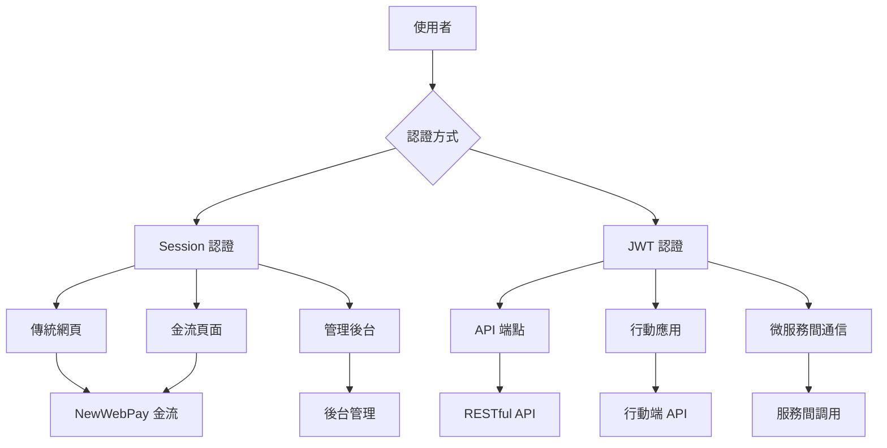

# 🔐 混合認證架構設計說明

## 💡 為什麼需要 Session + JWT 混合認證？

### 📊 **您的系統現況分析**



## 🎯 **混合認證的優勢**

### 1. **保持現有金流系統穩定**
```java
// ✅ 現有金流 API 繼續使用 Session（不受影響）
@PostMapping("/api/pay/cart")
public ResponseEntity<PayResponse> payCart(HttpSession session) {
    Integer uid = (Integer) session.getAttribute("uid");
    // 現有邏輯保持不變
}

// ✅ 新的安全 API 使用 JWT
@PostMapping("/api/v1/secure/payment")
@PreAuthorize("hasRole('USER')")
public ResponseEntity<?> securePayment(@AuthenticationPrincipal UserDetails user) {
    // 新的安全機制
}
```

### 2. **第三方金流兼容性**
```properties
# NewWebPay 回調不需要認證（重要！）
/api/notify                    # ✅ 跳過所有認證
/api/pay/**                    # ✅ 使用 Session 認證
/api/query_info                # ✅ 使用 Session 認證
/api/close_trade               # ✅ 使用 Session 認證
```

### 3. **現代化 API 安全**
```java
// ✅ 新版 API 使用 JWT 認證
/api/v1/**                     # JWT 認證
/api/mobile/**                 # 行動端 JWT 認證  
/api/secure/**                 # 高安全性 JWT 認證
```

## 📋 **路徑認證規則對照表**

| 路徑模式 | 認證方式 | 用途 | 說明 |
|---------|---------|------|------|
| `/api/notify` | 無需認證 | 金流回調 | NewWebPay 回調端點 |
| `/api/pay/**` | Session | 金流 API | 現有購物車支付 |
| `/api/query_info` | Session | 查詢交易 | 支付狀態查詢 |
| `/api/close_trade` | Session | 退款申請 | 退款處理 |
| `/login_success` | Session | 網頁 | 登入成功頁面 |
| `/mycarts` | Session | 網頁 | 購物車頁面 |
| `/api/v1/**` | JWT | 新版 API | 現代化 RESTful API |
| `/api/mobile/**` | JWT | 行動端 | 手機 APP API |
| `/api/secure/**` | JWT | 安全 API | 高安全性操作 |
| `/api/admin/**` | JWT | 管理 API | 管理員專用 |

## 🔧 **實作建議**

### **階段 1：保持現有系統運作**
```java
// 不修改現有的金流控制器
@RestController 
@RequestMapping("/api")
public class PayController {
    // 保持原有的 Session 認證邏輯
    @PostMapping("/pay/cart")
    public ResponseEntity<PayResponse> payCart(HttpSession session) {
        // 現有邏輯不變
    }
}
```

### **階段 2：新增 JWT 安全端點**
```java
// 新建安全版本的控制器
@RestController
@RequestMapping("/api/v1")
public class SecurePayController {
    
    @PostMapping("/payment/create")
    @PreAuthorize("hasRole('USER')")
    public ResponseEntity<?> createPayment(
        @AuthenticationPrincipal UserDetails user,
        @RequestBody PaymentRequest request) {
        // 使用 JWT 認證的新版支付 API
    }
}
```

### **階段 3：漸進式遷移**
```java
// 提供向後兼容的雙重認證支援
@PostMapping("/api/hybrid/payment")
public ResponseEntity<?> hybridPayment(
    HttpServletRequest request,
    HttpSession session) {
    
    // 檢查 JWT 認證
    String authHeader = request.getHeader("Authorization");
    if (authHeader != null && authHeader.startsWith("Bearer ")) {
        // 使用 JWT 認證邏輯
        return handleJwtPayment(request);
    }
    
    // 回退到 Session 認證
    Integer uid = (Integer) session.getAttribute("uid");
    if (uid != null) {
        // 使用 Session 認證邏輯
        return handleSessionPayment(session);
    }
    
    throw new UnauthorizedException("需要認證");
}
```

## 🛡️ **安全性增強**

### **1. 金流安全加固**
```java
@Component
public class PaymentSecurityAspect {
    
    @Around("@annotation(PaymentEndpoint)")
    public Object enhancePaymentSecurity(ProceedingJoinPoint point) {
        // 1. IP 白名單檢查（NewWebPay 回調）
        // 2. 簽章驗證
        // 3. 重放攻擊防護
        // 4. 異常監控
        return point.proceed();
    }
}
```

### **2. API 版本管理**
```java
// 舊版本：保持兼容性
@RequestMapping("/api/pay")
@Deprecated
public class LegacyPayController { }

// 新版本：現代化安全
@RequestMapping("/api/v1/payment")
public class ModernPayController { }

// 未來版本：進一步增強
@RequestMapping("/api/v2/payment")
public class FuturePayController { }
```

## 📈 **遷移計劃**

### **第一階段：基礎設施（已完成）**
- ✅ JWT 服務建立
- ✅ 安全配置設定
- ✅ 限流機制
- ✅ 監控系統

### **第二階段：混合認證（進行中）**
- 🔄 混合安全配置
- 🔄 路徑認證規則
- ⏳ 測試驗證

### **第三階段：新版 API（規劃中）**
- ⏳ 建立 `/api/v1/*` 端點
- ⏳ 行動端 API 設計
- ⏳ 微服務整合

### **第四階段：逐步遷移（未來）**
- ⏳ 前端改造支援 JWT
- ⏳ 使用者體驗優化
- ⏳ 效能監控和調優

## 🎯 **總結**

### **為什麼需要 JWT？**

1. **🔒 未來擴展性**：支援行動應用、微服務架構
2. **🌐 無狀態設計**：適合分散式系統和雲端部署
3. **📱 跨平台支援**：統一的認證機制
4. **🔐 現代安全標準**：符合業界最佳實踐
5. **⚡ 效能優化**：減少服務器狀態管理負擔

### **實際建議**

✅ **立即執行**：
- 保持現有金流系統不變
- 實作混合認證配置
- 建立新版安全 API 端點

🔄 **逐步進行**：
- 前端漸進式改造
- API 版本化管理
- 效能監控和優化

⚠️ **注意事項**：
- 確保金流回調端點無需認證
- 保持向後兼容性
- 詳細的測試計劃

**您的金流系統可以繼續使用 Session，同時享受 JWT 帶來的現代化優勢！** 🚀